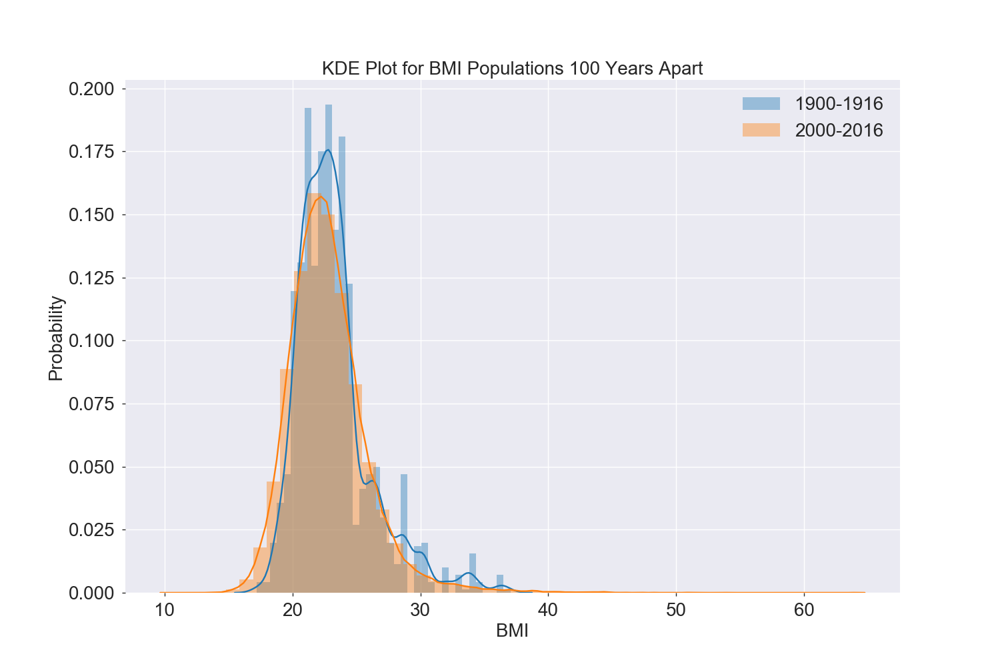
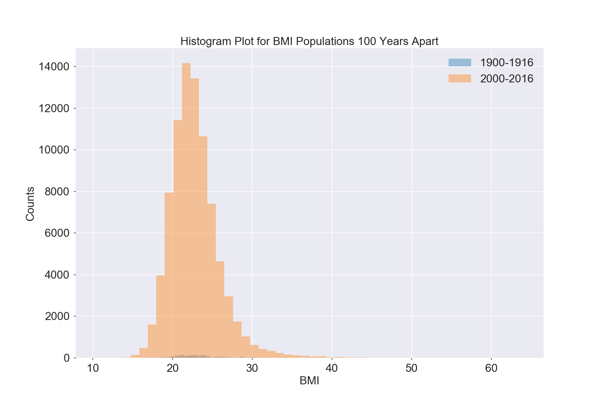
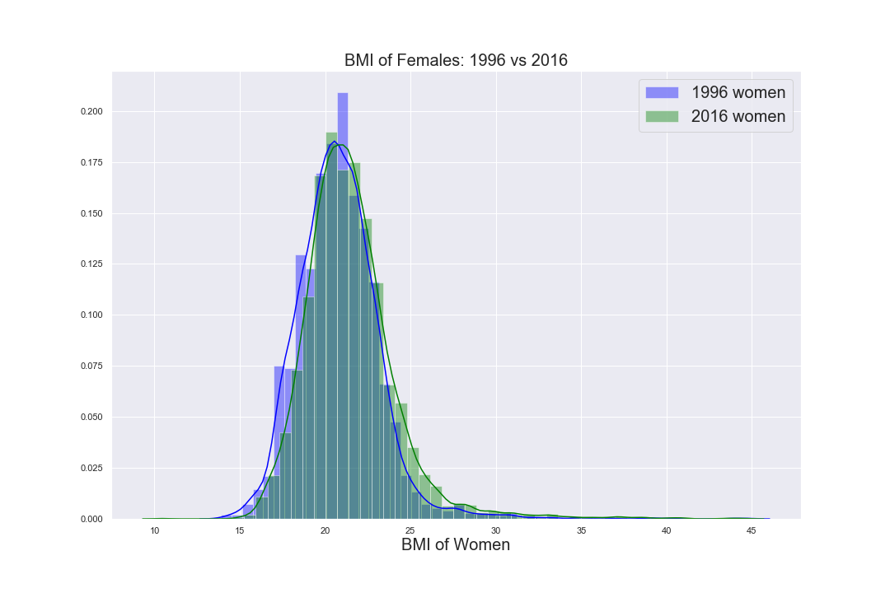
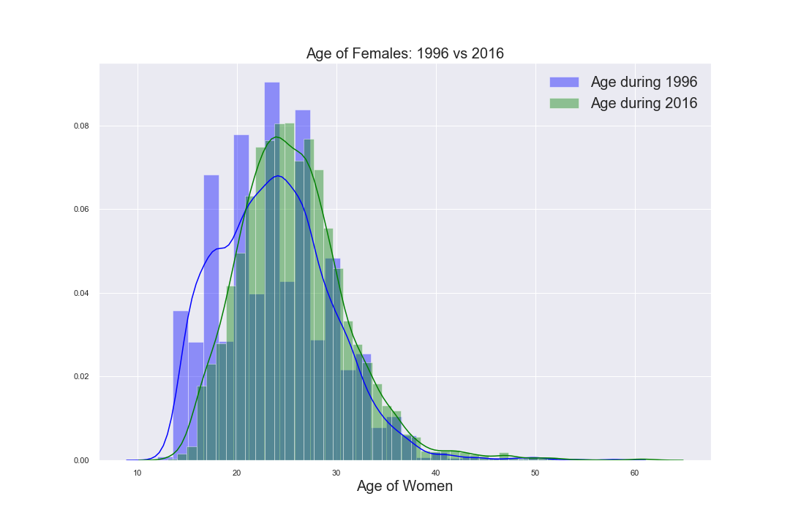
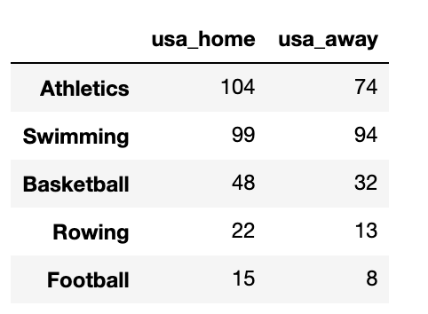

# Mod_3_Stats_Project_Tim_Emefa

120 Years of Olympics Data
This data set was taken from kagggle and contains 120 years of info about Olympic athletes. We used this data set to practice some hypothesis testing. The data can be found here:

https://www.kaggle.com/heesoo37/120-years-of-olympic-history-athletes-and-results

The objective of this project was to analyze BMI data for Olympic athletes; in particular, to use hypothesis tests to see if there was a change in the BMI of athletes of the past when compared to athletes of current times. In addition to this, we used ANOVA testing to see if we could find supporting evidence that the US performs better in competition when hosting the Olympics versus when they compete abroad. 

To start, we observed the kernel density plots and histograms of the two populations (1900 to 1916 athletes, hereon referred to as 1900 population and the 2000 to 2016 athletes, hereon referred to as 2000 population). The plots showed that the mean BMI's of each population were likely a little different. The histogram after it revealed that we had overwhelmingly more data on the 2000 population than the 1900 population.

To exercise a basic z-test, we decided to take random samples of the 2000-2016 population and run our hypothesis tests against the known 1900-1916 population. We chose to use the standard $\alpha = 0.05$ and decided to run a z-test 10,000 times. From this we observed all the resulting p-values. If the two populations are one in the same, we would expect a p-value of 0.05 to come up 5% of the time or around 500 times. Our null hypothesis stated no change between the BMI populations (a p-value of 0.05 comes up close to 500 times or less), and the alternative hypothesis stated a difference between the populations (a p-value of 0.05 or less comes up much more frequently than 500 times). 

 There is no difference in BMI between populations  

 There is a difference

From this test, we found a p-value less than 0.05 came up nearly 2,500 times out of the 10,000 simulations. From this evidence we rejected the null hypothesis and accepted that the BMI's had changed over time. Since we have the actual populations, we can just look at the means for comparison to confirm our statistics.

   

Yes, they're different.

Looks like athletes have a lower BMI 100 years later. Why is that? Have world athletes gotten smaller over time?

A little bit of investigation of the data frame shows that, although there are female athletes in the 1900-1916 population, they are missing data about their height and weight and are therefore not represented by their BMI.

The 2000-2016 has overwhemingly more female athletes in it. So we ran the same hypothesis tests again, one for the males and the other for the females.

For the male athletes, out of 10,000 trials, we attained a p-value of less than 0.05 only 21 times. 9,978 times out of 10,000 our p-value was greater than 0.05. Based on this evidence, we failed to reject the null hypothesis, which suggests that the BMI has not changed for male athletes in the Olympics over the last 100 years.

For the female athletes, the same z-test model was perfomed to analyze two hypothesis questions. One hypothesis was to see if there was a difference in BMI measurements of women from 1996 and 2016 and the other hypothesis was to see if there was any age difference in women participants from 1996 and 2016. The 1996 Summer Olympics was considered the "Summer of Women" because the U.S. women's sports teams dominated in the majority of the sports they performed in. Was this feat enough to cause some change in the Olympic women participants 20 years later?

After running the z-tests, the p-value generated was greater than our alpha value of 0.05 and thus we could not reject our null hypothesis. As a result, it was concluded that there no significant difference in the BMI measurements or age of women for the 1996 and 2016 Olympics. The distributions are displayed below.

Finally, we wanted to investigate the question: Does the US perform better when hosting the Olympics or when abroad?
We observed the top 5 sports in which the US competes in at home and away and did an ANOVA test to see if there was any signficant difference in the gold medals won. To do this, we judged the top 5 categories by the number of gold medals won. That is for the top 5 events, we counted the number of gold medals won at home in the first column and the number of gold medals won away in the second column. We then standardized the gold medal count by dividing by the number of events competed in. On this data frame, we performed an ANOVA test. Dataframe is shown below.

Since the US has participated in the Olympics away far more times than at home, we randomly sampled the away data to pick 5 cities for comparison.

The critical F value for this test was 5.79. Our F statistic returned 6.29. Since our F stat was above the critical value, we rejected the null hypothesis. This suggests performance is the better for the U.S. when hosting the olympics.

 

